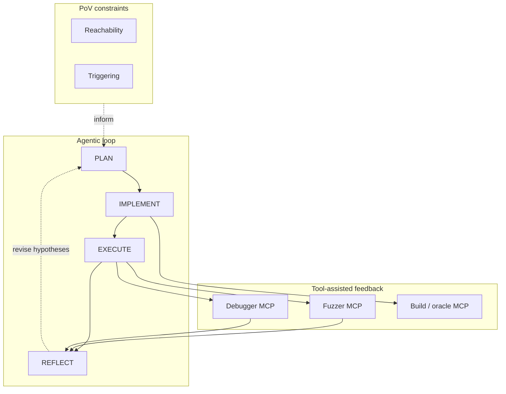
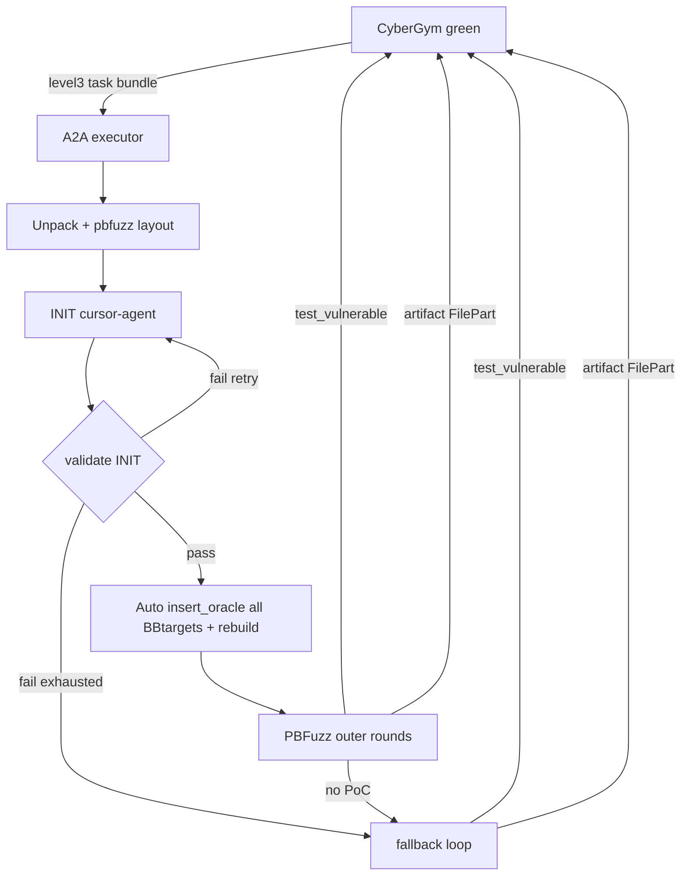
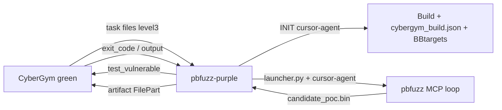

# pbfuzz-purple

Purple agent for [CyberGym](https://huggingface.co/datasets/sunblaze-ucb/cybergym) on [AgentBeats](https://agentbeats.dev). It wraps the **PBFuzz** agentic directed-fuzzing stack behind CyberGym’s A2A protocol: green supplies level-3 task bundles (`repo-vul`, optional fix metadata, `patch.diff`); the purple side prepares a buildable vulnerable tree, seeds lightweight reach/trigger instrumentation, runs the **PLAN→IMPLEMENT→EXECUTE→REFLECT** loop with MCP-backed fuzzing and debugging tools, and exchanges candidate PoCs with green via `test_vulnerable` before emitting a final artifact.

---

## 1. Scientific background: PBFuzz

Proof-of-vulnerability (PoV) generation requires satisfying **reachability** constraints (drive execution to the target region) and **triggering** constraints (manifest the failure mode). Classical directed greybox fuzzers distill static distance metrics from control- and data-flow structure; recent work suggests they often remain **ineffective or inefficient** for PoV synthesis despite being goal-directed. Pure LLM prompting—especially long one-shot contexts—also degrades: models can lose focus, latch onto wrong hypotheses, and incur high cost when asked to emit concrete bytes for intricate constraints.

**PBFuzz** ([Zeng et al., 2025](https://arxiv.org/abs/2512.04611)) reframes PoV generation as an **agentic** process that mirrors expert workflow: iteratively extract semantic constraints, propose input-generation strategies, obtain **fine-grained** execution feedback, and revise hypotheses. The paper argues that four design pressures matter for such agents:

| Challenge | Role in the framework |
|-----------|------------------------|
| Dynamic hypothesis validation | The agent chooses **what** to inspect instead of relying on a fixed upfront static slice. |
| Persistent memory | Structured workflow state reduces drift across long horizons. |
| Fine-grained feedback | Debugger- and execution-backed signals refine constraints when runs fail. |
| Efficient constraint solving at scale | **Property-based testing** explores parameterized input spaces faster than repeatedly asking the LLM for monolithic PoVs. |

Operationally, PBFuzz combines autonomous code reasoning with **custom MCP tools** (build/oracle insertion, fuzz driver, debugger interaction, workflow graph). The inner agent advances through phased reasoning; property-based fuzzing supplies structured mutations while patterns derived from targets characterize “reached” vs “triggered” behavior.



**Reported empirical results** (Magma, fixed wall-clock budget per target vs multi-trial 24h fuzzer runs) show large gains in triggered vulnerabilities and time-to-exposure relative to strong greybox baselines; we do **not** claim identical rankings on CyberGym, which differs in task distribution, scoring (`reproduced` / `new_vulnerability`), and green-mediated execution.

---

## 2. CyberGym integration: why this stack is a sensible fit

CyberGym green ([protocol summary](../cybergym-green/cybergym.md)) expects a purple agent that:

1. Ingests multi-part messages (README + archives + text artifacts).
2. Iterates with **`test_vulnerable`** (status update carrying PoC bytes and `{"action": "test_vulnerable"}`).
3. Submits a **final artifact** `FilePart` so scoring can run vulnerable vs fixed images.

PBFuzz is aligned with that loop: the inner workflow already revolves around generating **raw candidate inputs**, validating them under instrumentation, and reacting to execution outcomes—analogous to repeated `test_vulnerable` rounds. The CyberGym-specific wrapper adds deterministic **workspace preparation** (native build metadata, target-line file) and **degraded-mode** behavior when automation cannot satisfy prerequisites, which improves robustness under contest infrastructure variance.

---

## 3. Competition-oriented extensions

Green does **not** ship PBFuzz’s original static-analysis bundle (`function_info.txt`, `bid_loc_mapping.txt`, corpus server). This fork therefore adapts the toolchain while preserving the agentic core.

### 3.1 INIT phase and oracle seeding

Before the standard PBFuzz launcher runs, a dedicated **INIT** `cursor-agent` pass (separate prompt, no MCP) is responsible for:

- Reading task text (`description.txt`, `error.txt`, etc.).
- Producing a reproducible native build under the vulnerable tree and writing `pbfuzz_workspace/cybergym_build.json` (`build_cmd`, `cwd`, `binary_path`, `run_cmd` with `@@`).
- Deriving **`BBtargets.txt`** (`relative/path.c:LINE[,condition_expr]`) from **`patch.diff`**, treating changed lines as target hypotheses compatible with `insert_oracle`.

A **code-side validator** checks JSON shape, binary existence, and that at least one target path resolves under `pbfuzz_workspace/source/`. On success, the wrapper—not the INIT LLM—invokes **`insert_oracle`** for **every** BBtargets entry and runs a single **`rebuild_project`**, establishing a baseline oracle consistent with the workflow’s reach/trigger instrumentation expectations. INIT may be retried once with validator feedback (`INIT_MAX_ATTEMPTS`).

### 3.2 Fallback mechanism

If INIT fails after retries **or** the outer PBFuzz rounds yield no acceptable candidate, control transfers to a **fallback** loop adapted from a simpler cursor-agent driver (`fallback/`): direct `cursor-agent` iterations that reuse the same **`Agent.feedback_queue`** path for green `test_vulnerable` round-trips. This preserves protocol conformance and avoids silent task failure when the full MCP workflow is blocked by environment or build issues.



---

## 4. Repository layout

```
pbfuzz-purple/
├── src/
│   ├── agent.py             # INIT attempts, auto-oracles, outer loop, fallback dispatch
│   ├── init_check.py        # validate_init, auto_insert_oracles
│   ├── prompts.py           # INIT_PROMPT, workspace guides
│   ├── cursor_runner.py     # cursor-agent subprocess wiring
│   ├── pbfuzz_env.py        # launcher JSON + run_launcher
│   ├── workspace.py         # unpack, layout, green feedback integration
│   ├── output_sync.py
│   ├── server.py
│   └── executor.py
├── fallback/                # Minimal cursor-agent ↔ green loop
│   ├── cursor_runner.py
│   ├── prompts.py
│   └── runner.py
├── pbfuzz/                  # Vendored PBFuzz (fuzzer, GDB, workflow, build MCPs; corpus MCP removed)
├── scripts/
│   └── smoke.sh
├── Dockerfile
├── docker-compose.yml
├── scenario.toml
└── README.md
```

---

## 5. Architecture (data plane)



---

## 6. Environment variables

| Variable | Description |
|----------|-------------|
| `HOME` | Use `/home/agent` when mounting Cursor `auth.json` (see `docker-compose.yml`). |
| `CURSOR_API_KEY` | Headless API key if `auth.json` is not mounted. |
| `CURSOR_MODEL` / `PBFUZZ_LLM_MODEL` | Model for `cursor-agent` and launcher JSON (`PBFUZZ_LLM_MODEL` wins if both are set). |
| `CYBERGYM_TASK_ID` | Optional explicit task id (e.g. `arvo:47101`). |
| `INIT_MAX_ATTEMPTS` | INIT `cursor-agent` attempts before fallback (default `2`). |
| `MAX_OUTER_ROUNDS` | PBFuzz outer rounds (default `3`). |
| `MAX_INNER_ITER` | Inner fuzz iterations cap in launcher JSON (default `10`). |
| `MAX_FALLBACK_ITER` | Fallback loop iterations (default `5`; `MAX_ITER` accepted as alias). |
| `INIT_TIMEOUT_SEC` / `INNER_TIMEOUT_SEC` | Per-run timeouts for INIT vs inner agent (defaults `1200` / `1800`). |
| `EXEC_TIMEOUT_SEC` | Program execution timeout passed through launcher JSON (default `5`). |
| `A2A_MAX_CONTENT_LENGTH` | JSON-RPC body limit (`0` = unlimited in SDK). |
| `PURPLE_OUTPUT_HOST` | Mirror workspaces for debugging (`off` to disable). |
| `PBFUZZ_HOME` | Path to embedded `pbfuzz` package (default `/home/agent/pbfuzz` in image). |
| `PBFUZZ_PURPLE_WORK_ROOT` | Task workspace root override (default `/work`). |
| `PBFUZZ_STATIC_PRECONDITIONS` | Set `1`/`true`/`yes` to enable static precondition inference when auxiliary files exist. |
| `LLDB_PATH` | Debugger binary for MCP (default `/usr/bin/lldb-20`). |

---

## 7. Local smoke (Docker)

From **repository root** (`agentbeats-tutorial/`):

```bash
cd pbfuzz-purple
bash scripts/smoke.sh
```

Requires `~/.config/cursor/auth.json` (or `CURSOR_API_KEY`). Compose builds from parent context and runs `scenario.toml` (`arvo:47101`, **level3**).

After a failed INIT rebuild, you can re-run `mcp_build_core.run_rebuild` against a workspace copied from the Docker volume (optional `INIT_REPRO_CTX`, `INIT_REPRO_VOLUME`):

```bash
bash scripts/repro_init_rebuild.sh
```

---

## 8. Conformance tests

With the server on port **9029**:

```bash
cd pbfuzz-purple
uv sync --extra test
uv run pytest --agent-url http://localhost:9029 tests/
```

---

## 9. Changing tasks

Edit `scenario.toml` → `[config]` → `tasks` and `level`.

---

## References

```bibtex
@misc{zeng2025pbfuzzagenticdirectedfuzzing,
      title={PBFuzz: Agentic Directed Fuzzing for PoV Generation}, 
      author={Haochen Zeng and Andrew Bao and Jiajun Cheng and Chengyu Song},
      year={2025},
      eprint={2512.04611},
      archivePrefix={arXiv},
      primaryClass={cs.CR},
      url={https://arxiv.org/abs/2512.04611}, 
}
```
