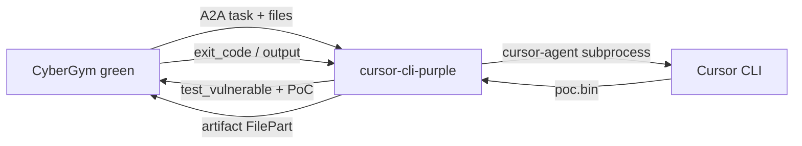

# cursor-cli-purple

Purple agent for the [CyberGym](https://huggingface.co/datasets/sunblaze-ucb/cybergym) green benchmark on [AgentBeats](https://agentbeats.dev): it bridges A2A task messages to repeated `cursor-agent -p` runs, asks the green agent to execute PoCs on the vulnerable Docker image, then submits the final PoC as an artifact.

## Architecture



## Environment variables

| Variable | Required | Description |
| -------- | -------- | ----------- |
| `HOME` | Docker only | Should be `/home/agent` so `cursor-agent` reads `~/.config/cursor/auth.json` under that home (the server can create this file from `CURSOR_AUTH`). |
| `CURSOR_AUTH` | Docker / smoke | Standard base64 of `~/.config/cursor/auth.json` file bytes. The server decodes it at startup and writes `auth.json` under `HOME`. Alternative to bind-mounting the file. |
| `CURSOR_MODEL` | No | Passed as `--model` when set (e.g. `haiku-4.5`). |
| `MAX_ITER` | No | Max cursor iterations per task (default `5`). |
| `AGENT_RUN_TIMEOUT_SEC` | No | Wall-clock seconds for the whole PoC task (`agent.run`); after this the task is **failed** and abandoned (default **`600`** / 10 minutes). |
| `A2A_MAX_CONTENT_LENGTH` | No | Max JSON-RPC body size in bytes. Code default **2GiB**; compose defaults to **`0`** (unlimited) so level3 dual-tar payloads are accepted. |
| `PURPLE_OUTPUT_HOST` | No | If set to a path (or `default` / `1`), mirrors each `context_id` workspace under that directory for debugging. Use `off` / `none` / empty to disable. Default in compose: `/home/agent/purple_agent_output` → host `./purple_agent_output`. |

CLI flag **`--output-host [PATH]`** sets `PURPLE_OUTPUT_HOST` (omit `PATH` to use `cursor-cli-purple/purple_agent_output` next to `src/`).

## Human debugging output (`purple_agent_output`)

When enabled, each assessment context gets a folder under the chosen root (default `./purple_agent_output` on the host when using compose):

- `WORKSPACE_FILES_GUIDE.txt` — same workspace file list as in `prompts.py` (`WORKSPACE_FILES_GUIDE`).
- `TASK.md`, `description.txt`, `error.txt`, `feedback.json`, `patch.diff` when present.
- `make_poc.py`, `poc.bin` when present.
- `cursor_agent_*_<phase>.log` snapshots and append-only `cursor_agent_all_output.txt` (full cursor-agent text output).
- `sync_manifest.jsonl` — one JSON line per sync phase.

Mirroring is best-effort; failures there do **not** fail the agent.

## Local smoke (Docker)

From this directory:

```bash
# Requires Cursor desktop `auth.json` at ~/.config/cursor/auth.json (smoke encodes it into CURSOR_AUTH), or set CURSOR_AUTH yourself.
# optional: export CURSOR_MODEL=claude-4.5-sonnet
bash scripts/smoke.sh
```

This pulls `cybergym-green`, builds the purple image and the repo-root `Dockerfile.client_cli` client, then runs `scenario.toml` (`arvo:47101`, `level1`, one worker). The client exits `0` when the assessment finishes. After a run, inspect `./purple_agent_output/<context_id>/` for mirrored artifacts.

**Background stack + log file:** `bash scripts/smoke-bg.sh` keeps `cybergym-green` and `cursor-cli-purple` running under `docker compose up -d`, appends both services’ logs to `compose-follow.log`, runs the client (client stdout is also tee’d there), then tears the stack down. Follow progress with `tail -f compose-follow.log`. Override the path with `COMPOSE_LOG_FILE=/path/to/log`.

### Docker socket permissions

The green service needs access to the host Docker socket. If the container user cannot read `/var/run/docker.sock`, adjust host permissions or group membership; a coarse workaround is documented in `plan.md` (repository root).

## Manual PoC test (same container images as CyberGym)

CyberGym stages the PoC under **`/tmp/poc`** (see `cybergym-green/src/agent.py`). Image-specific command:

1. Pull the task images (example task `arvo:47101`):

```bash
docker pull n132/arvo:47101-vul
CID=$(docker create n132/arvo:47101-vul /bin/arvo)
docker cp ./poc.bin "$CID:/tmp/poc"
docker start -ai "$CID"; RC=$?; docker rm "$CID"; echo "exit_code=$RC"
```

2. Run your PoC against the **vulnerable** image (non‑interactive pattern):

```bash
docker pull cybergym/arvo:47101-vul
docker pull cybergym/arvo:47101-fix
CID=$(docker create cybergym/arvo:47101-vul run_poc)
docker cp ./poc.bin "$CID:/tmp/poc"
docker start -ai "$CID"; RC=$?; docker rm "$CID"; echo "exit_code=$RC"
```

Expect a non‑zero exit on **`-vul`** when the PoC triggers the bug. Optional: same against **`-fix`** — CyberGym scores `reproduced` when vul ≠ 0 and fix == 0.

You can copy `poc.bin` (and `make_poc.py`) from `./purple_agent_output/<context_id>/` after a purple run.

**Minimal test environment:** only Docker is required for the above; you do not need the compose stack. To refresh task files (TASK.md, `repo-vul.tar.gz`, …) without running an assessment, use the HuggingFace dataset `sunblaze-ucb/cybergym` or copy from a previous `./purple_agent_output/` tree.

## Changing tasks

Edit `scenario.toml` → `[config]` → `tasks` and `level` (e.g. `arvo:47101`, `level3`).

## Conformance tests

With the server listening on port 9019:

```bash
uv sync --locked --extra test
uv run pytest --agent-url http://localhost:9019
```

Plain text-only messages (no file parts) return a small echo artifact so the template-style A2A tests stay green; real CyberGym tasks always include file attachments.

## AgentBeats registration

Build and push an image, register the agent, then submit via Quick Submit or manual scenario flow as described in the [AgentBeats tutorial](https://docs.agentbeats.dev/tutorial/#manual-submit-advanced).
