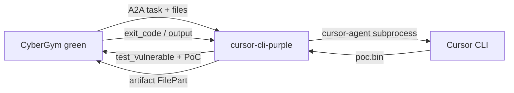

# cursor-cli-purple

Purple agent for the [CyberGym](https://huggingface.co/datasets/sunblaze-ucb/cybergym) green benchmark on [AgentBeats](https://agentbeats.dev): it bridges A2A task messages to repeated `cursor-agent -p` runs, asks the green agent to execute PoCs on the vulnerable Docker image, then submits the final PoC as an artifact.

## Architecture



## Environment variables

| Variable | Required | Description |
| -------- | -------- | ----------- |
| `CURSOR_API_KEY` | Yes | Cursor API key for `cursor-agent` inside the container |
| `CURSOR_MODEL` | No | Passed as `--model` when set (e.g. `haiku-4.5`) |
| `MAX_ITER` | No | Max cursor iterations per task (default `5`) |

## Local smoke (Docker)

From this directory:

```bash
export CURSOR_API_KEY=sk-...
# optional: export CURSOR_MODEL=haiku-4.5
bash scripts/smoke.sh
```

This pulls `cybergym-green`, builds the purple image and the repo-root `Dockerfile.client_cli` client, then runs `scenario.toml` (`arvo:47101`, `level1`, one worker). The client exits `0` when the assessment finishes; a non-zero score is not required for a protocol smoke run.

**Background stack + log file:** `bash scripts/smoke-bg.sh` keeps `cybergym-green` and `cursor-cli-purple` running under `docker compose up -d`, appends both services’ logs to `compose-follow.log`, runs the client (client stdout is also tee’d there), then tears the stack down. Follow progress with `tail -f compose-follow.log`. Override the path with `COMPOSE_LOG_FILE=/path/to/log`.

### Docker socket permissions

The green service needs access to the host Docker socket. If the container user cannot read `/var/run/docker.sock`, adjust host permissions or group membership; a coarse workaround is documented in `plan.md` (repository root).

## Changing tasks

Edit `scenario.toml` → `[config]` → `tasks` (keep `category:number` ids such as `arvo:47101`).

## Conformance tests

With the server listening on port 9019:

```bash
uv sync --locked --extra test
uv run pytest --agent-url http://localhost:9019
```

Plain text-only messages (no file parts) return a small echo artifact so the template-style A2A tests stay green; real CyberGym tasks always include file attachments.

## AgentBeats registration

Build and push an image, register the agent, then submit via Quick Submit or manual scenario flow as described in the [AgentBeats tutorial](https://docs.agentbeats.dev/tutorial/#manual-submit-advanced).
