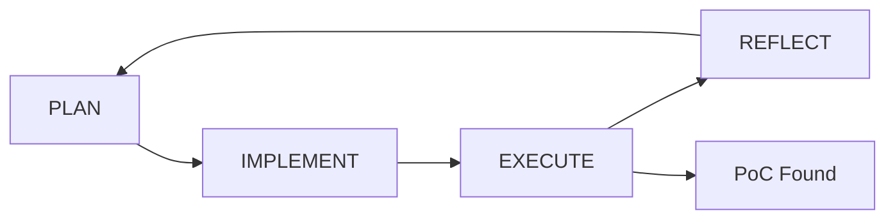

# Workflow State

<!-- ==================== STATIC SECTIONS ==================== -->
<!-- These sections contain configuration that can be replaced wholesale -->

<!-- STATIC:RULES:START -->
## Rules
- **MANDATORY**: Must enforce RULE_MANDATORY
- **Phase Gating**: Only allowed transitions:


> **Note**: INIT (build + initial BBtargets + initial oracle) is performed by the reproduction driver before this workflow starts. The binary already exists, oracles are already inserted, and `BuildInfo.dirty` is false on entry. This workflow begins at PLAN.

### PLAN Phase Rules
- **R-PL1**: On first entry, must read `static_results/BBtargets.txt` (Target Locations: `relative/path.c:LINE[,condition_expr]`) and the relevant source files via shell.
- **R-PL2**: Must write/update BugPredicates based on Target Locations.
- **R-PL3**: Must write/update Preconditions, RootCauses, and TriggerPlans based on source analysis, `inputs/fix.patch`, CVE description, and reflection from prior fuzz rounds.
- **R-PL4**: Forbidden to perform any manual test. Must apply RULE_FLOW to verify your hypothesis.
- **R-PL5**: Must apply RULE_IMPLICIT_BEHAVIOR and RULE_MULTI_TARGETS.
- **R-PL6**: ALLOWED TOOLS: Workflow MCP Tools, **`insert_oracle`** (optional refinement; the driver already inserted a baseline oracle for every BBtargets entry).
- **R-PL7**: When you need a tighter oracle, call **`insert_oracle(file, line, condition_expr, cve_id)`** to refine; the build server upserts BBtargets.txt automatically and marks `BuildInfo.dirty=true` so EXECUTE rebuilds.

### IMPLEMENT Phase Rules
- **R-IM1**: Must take ALL TriggerPlans and convert input constraints into concrete ParameterSpace
- **R-IM2**: Must enumerate every possible way the bug condition can be met in ParameterSpace. Must grep and consider all other values for categorical parameters
- **R-IM3**: Must generate FuzzPlan with 5-10 concrete tests covering ALL TriggerPlans. Must apply RULE_POC_WINDOW
- **R-IM4**: Must define Breakpoints for validating preconditions and capturing runtime state at bug sites
- **R-IM5**: ALLOWED TOOLS: extract_parameters, get_generator_api_doc, and Workflow MCP Tools

### EXECUTE Phase Rules
- **R-EX0**: If `BuildInfo.dirty == true`, MUST call **`rebuild_project()`** before **`fuzz`**. If rebuild fails, transition to PLAN.
- **R-EX1**: Must execute fuzz MCP tool using FuzzPlan and Breakpoints from IMPLEMENT phase
- **R-EX2**: Must update Metrics after fuzzing completes
- **R-EX3**: If bug triggered (pattern matched), must transition to SUCCESS
- **R-EX4**: If bug not triggered, must transition to REFLECT
- **R-EX5**: ALLOWED TOOLS: **`rebuild_project`**, fuzz, get_generator_api_doc, and Workflow MCP Tools; other actions are forbidden

### REFLECT Phase Rules
- **R-RF1**: Must analyze why testcases in FuzzPlan failed to trigger the bug. Focus only on testcase failure analysis, not memory updates. Transition to PLAN when ready to update memory based on findings.
- **R-RF2**: For no-reach testcases in FuzzPlan, must analyze why the execution path did not reach the target (read related code, compare with preconditions, and use launch_interactive_gdb when needed)
- **R-RF3**: For reach/no-trigger testcases in FuzzPlan, must identify why bug predicate was not triggered by tracing variable dependencies backward
- **R-RF4**: Must transition to PLAN phase if performed more than THREE manual test. This budget resets upon re-entering REFLECT.
- **R-RF5**: ALLOWED TOOLS: launch_interactive_gdb and Workflow MCP Tools
### RULE_IMPLICIT_BEHAVIOR:
- Never assume explicit code paths are the only ones
- Always account for implicit library behavior, special cases and compatibility hacks.
- Perform broader related code reading across the codebase.

### GATEKEEPER Rules (STRICTLY ENFORCED)
- **G-1**: RULE_PHASE_GATING
- **G-2**: Memory data modification permissions: PLAN (BugPredicates, Preconditions, RootCauses, TriggerPlans, BuildInfo), IMPLEMENT (ParameterSpace, FuzzPlan, Breakpoints), EXECUTE (Metrics, ParameterSpace), REFLECT (none - read-only)
- **G-3**: RULE_FLOW
- **G-4**: Auto-transition when phase tasks completed

### RULE_FLOW: PLAN→IMPLEMENT→EXECUTE→{REFLECT→PLAN | SUCCESS}

### RULE_POC_WINDOW: Prioritize malformed or boundary-skewed inputs that can bypass format checks to trigger bugs, not fully valid ones.

### RULE_MANDATORY: Always read workflow_state.md before every phase transition. Use workflow MCP server tools to update it.

### RULE_FILE_OPS: Must use workflow MCP server tools (write_workflow_block, transition_phase) for safe reading/writing

### RULE_SAFE_UPDATE: Never overwrite whole blocks unintentionally.

### RULE_PHASE_GATING: Each MCP tool blocked unless in correct phase with required prerequisites

### RULE_MEMORY: All state persisted in workflow_state.md; no ephemeral memory allowed

### RULE_DOCS: Do not create any extra markdown document other than workflow_state.md and project_config.md

### RULE_MAGMA: Do not analyze Magma benchmark instrumentation. See magma.md.

### RULE_FUZZ_TOOL: Only fuzz MCP tool in EXECUTE phase can declare PoC. DO NOT write `candidate_poc.bin` or `CANDIDATE_READY` by hand.

### RULE_MULTI_TARGETS: Triggering one target is sufficient. If a target has multiple triggering conditions, satisfy any bug predicate is sufficient. Prioritize simpler bug predicates.

<!-- STATIC:RULES:END -->

<!-- ==================== DYNAMIC SECTIONS ==================== -->
<!-- These sections are managed by the AI during workflow execution -->

<!-- DYNAMIC:STATE:START -->
## State
```json
{
  "phase": "PLAN",
  "status": "Driver completed INIT (build + oracle insertion). Ready for PLAN.",
  "current_task": "Derive BugPredicates, TriggerPlans from BBtargets.txt + fix.patch",
  "next_action": "Read BBtargets.txt and inputs/fix.patch; refine oracle if needed, then transition_phase(IMPLEMENT)"
}
```
<!-- DYNAMIC:STATE:END -->

<!-- DYNAMIC:BUILD_INFO:START -->
## BuildInfo
```json
{
  "build_cmd": "",
  "binary_path": "",
  "dirty": false,
  "last_build_log_excerpt": "",
  "build_attempts": 0
}
```
<!-- DYNAMIC:BUILD_INFO:END -->

<!-- DYNAMIC:BUG_PREDICATES:START -->
## BugPredicates
```json
[]
```
<!-- DYNAMIC:BUG_PREDICATES:END -->

<!-- DYNAMIC:PRECONDITIONS:START -->
## Preconditions
```json
[]
```
<!-- DYNAMIC:PRECONDITIONS:END -->

<!-- DYNAMIC:ROOT_CAUSES:START -->
## RootCauses
```json
[]
```
<!-- DYNAMIC:ROOT_CAUSES:END -->

<!-- DYNAMIC:PARAMETER_SPACE:START -->
## ParameterSpace
```json
{}
```
<!-- DYNAMIC:PARAMETER_SPACE:END -->

<!-- DYNAMIC:TRIGGER_PLANS:START -->
## TriggerPlans
```json
[]
```
<!-- DYNAMIC:TRIGGER_PLANS:END -->

<!-- DYNAMIC:FUZZ_PLAN:START -->
## FuzzPlan
```json
[]
```
<!-- DYNAMIC:FUZZ_PLAN:END -->

<!-- DYNAMIC:BREAKPOINTS:START -->
## Breakpoints
```json
[]
```
<!-- DYNAMIC:BREAKPOINTS:END -->

<!-- DYNAMIC:METRICS:START -->
## Metrics
```json
{
  "total_iterations": 0,
  "total_reached_count": 0,
  "last_reached_count": 0,
  "triggered_count": 0,
  "timeout_count": 0,
  "error_count": 0,
  "last_updated": ""
}
```
<!-- DYNAMIC:METRICS:END -->
